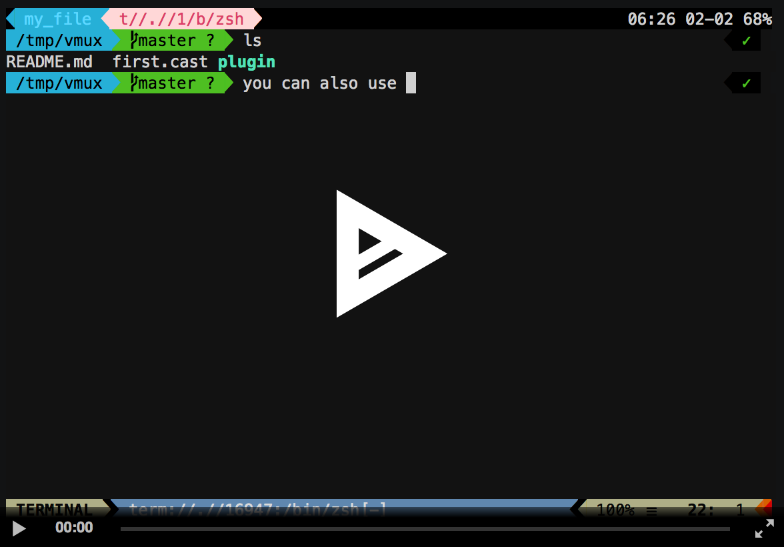

# vmux

Helper to use neovim as a terminal multiplexer

[](https://asciinema.org/a/RFV64c2xgU2rmTH1GTBfaVwe5)

# install

First, you need to install [abduco](https://github.com/martanne/abduco).

Add and install the following vim plugin: 

```
Plug 'yazgoo/vmux'
```

Then add the following to your .zshrc or .bashrc

```
source ~/.config/nvim/plugged/vmux/plugin/setup_vmux.sh
```

Or if you want to use vim instead of nvim:

```
source ~/.config/nvim/plugged/vmux/plugin/setup_vmux.sh vim
```

# usage

Run `vmux` for vmux command usage help
Run `:help vmux` from within vim for more in depth help.

# detaching

You can detach from the session with ^g
